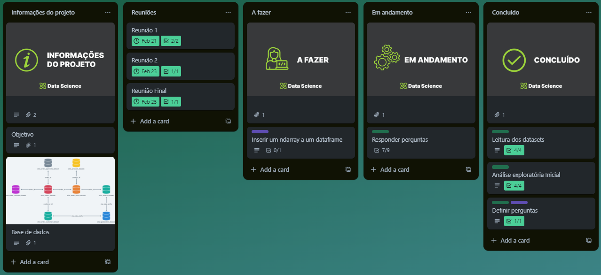

# Análise Exploratória de Dados

- Projeto: EDA (Análise Exploratória de Dados) com Pandas e Numpy
- Curso: Data Science - Santander Coders 2023 | 2º Semestre
- Módulo: Técnicas de Programação I
- Professor: Thiago

## Por: Otávio, Tainah, Hugo e Daniel

## 1. OBJETIVO

O objetivo deste projeto é aplicar os conhecimentos adquiridos ao longo da disciplina de Técnicas de Programação I em um contexto prático, relevante e data-driven. Realizando uma análise exploratória de dados de vendas online, utilizando um conjunto de dados real, extraindo insights e entendendo melhor o fenômeno das vendas, utilizando apenas as bibliotecas Numpy e Pandas.

## 2. METODOLOGIAS ÁGEIS

Para este projeto foi utilizada a ferramenta de gestão de projetos [Trello](https://trello.com/b/v8IAs6a9/projeto-pandas-ada). Utilizado para manter o projeto organizado, facilitando a colaboração entre os membros da equipe e garantido que o projeto seja concluído dentro do prazo estabelecido.

## 3. BASE DE DADOS

Essa base apresenta dados de pedidos feitos na Olist Store do ano de 2016 a 2018

Fonte: [Kaggle - Vendas Online da Olist](https://www.kaggle.com/datasets/olistbr/brazilian-ecommerce)

- ``Order:`` Este é o conjunto de dados principal. De cada pedido você pode encontrar todas as outras informações
- ``Customers:`` Informações sobre o cliente e sua localização.
- ``Geolocation:`` Informações dos CEPs e suas coordenadas lat/lng.
- ``Order Items:`` Dados sobre os itens adquiridos em cada pedido.
- ``Payments:`` Dados sobre as opções de pagamento dos pedidos.
- ``Order Reviews:`` Dados sobre as avaliações feitas pelos clientes.
- ``Products:`` Dados sobre os produtos vendidos pelo site.
- ``Sellers:`` Dados sobre os vendedores que atenderam aos pedidos feitos no site.

## 4. FERRAMENTAS

- Pandas
- Numpy
- Matplotlib
- Seaborn
- Git
- Trello

## 5. REFERÊNCIAS

- https://pandas.pydata.org/
- https://numpy.org/doc/stable/
- https://matplotlib.org/stable/
- https://seaborn.pydata.org/
- https://www.kaggle.com/datasets/olistbr/brazilian-ecommerc

